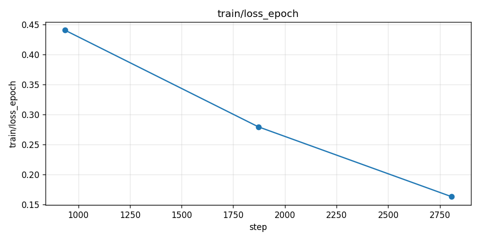
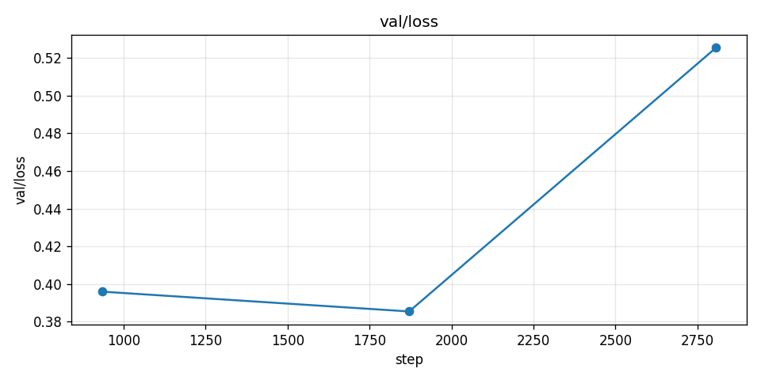
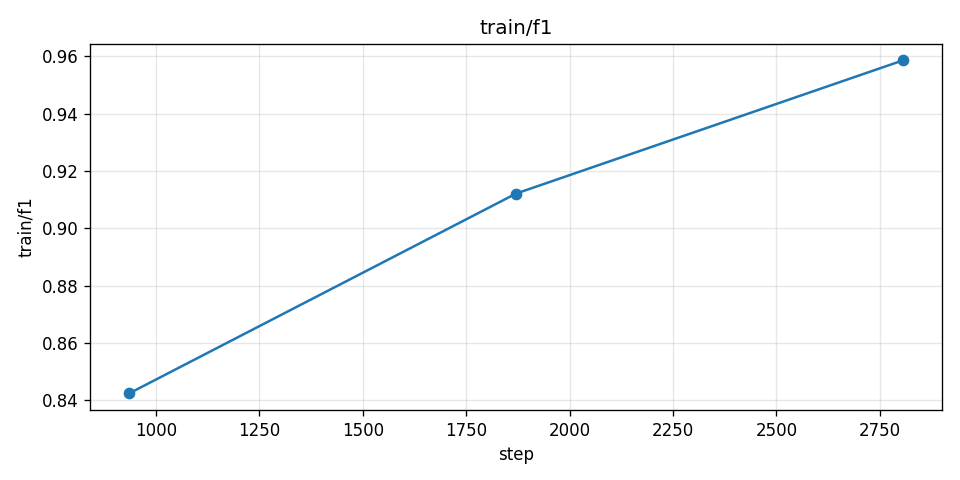
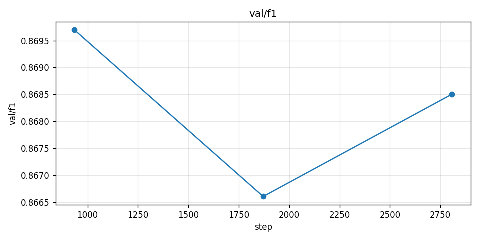
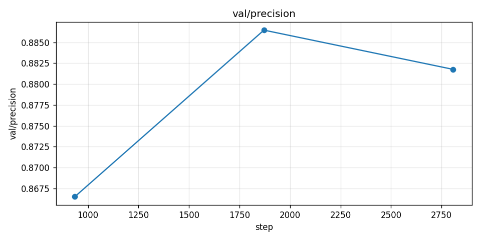
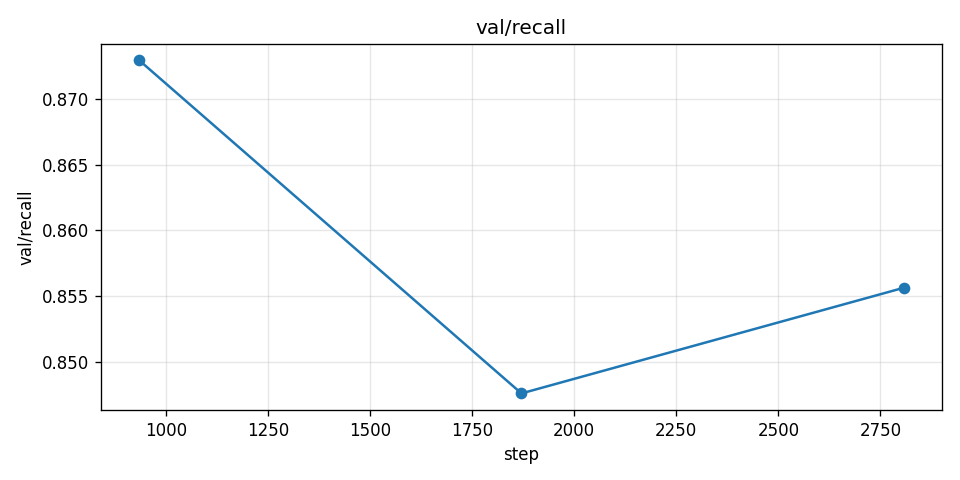
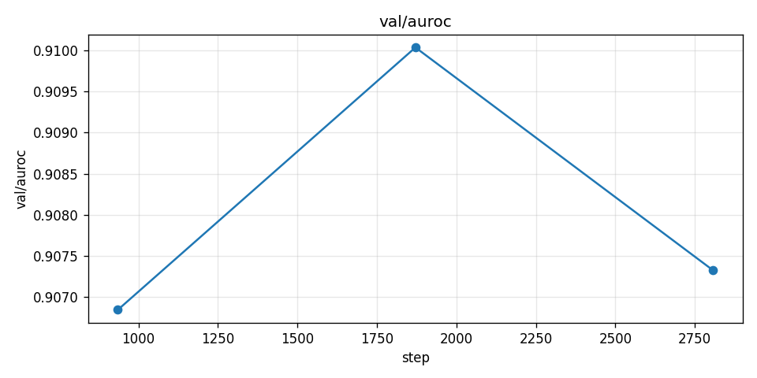

# Disaster Tweets Classifier

**Автор:** Хафизов Фанис Адикович

Бинарная классификация твитов: описывает ли сообщение реальное стихийное бедствие.

---

## Постановка задачи

Разработать ML-систему, которая по тексту твита определяет, относится ли он к реальному стихийному бедствию (класс `1`) или нет (класс `0`). Система применима для:

- мониторинга соцсетей экстренными службами в реальном времени;
- фильтрации информационного шума при работе журналистов и аналитиков;
- агрегации ситуационной картины в кризисных центрах ([Imran et al., 2015](https://dl.acm.org/doi/10.1145/2771588)).

### Формат входных и выходных данных

**Вход** (CSV/JSON):

```json
{
  "id": 1,
  "keyword": "ablaze",
  "location": "Birmingham",
  "text": "Our Deeds are the Reason of this #earthquake May ALLAH Forgive us all"
}
```

- `text` — основной признак, средняя длина 15–25 слов, максимум — 128 токенов после токенизации;
- `keyword` и `location` — опциональные, пропуски ~30–40%.

**Пример реальной записи из `train.csv`:**

| id  | keyword | location                      | text                                                                  | target |
| --- | ------- | ----------------------------- | --------------------------------------------------------------------- | ------ |
| 1   | NaN     | NaN                           | Our Deeds are the Reason of this #earthquake May ALLAH Forgive us all | 1      |
| 4   | NaN     | NaN                           | Forest fire near La Ronge Sask. Canada                                | 1      |
| 31  | ablaze  | Est. September 2012 - Bristol | We always try to bring the heavy. #metal #RT http://t.co/YAo1e0xngw   | 0      |

**Выход** (CSV/JSON):

```json
{
  "id": 1,
  "target": 1,
  "probability": 0.92
}
```

- `target` $\in \{0, 1\}$ — итоговое решение после применения порога;
- `probability` $\in [0, 1]$ — вероятность класса `1` после калибровки (используется для пороговой постобработки и мониторинга).

### Метрики

Метрики выбраны в соответствии с практикой работ по кризисной информатике ([Alam et al., 2021, CrisisBench](https://arxiv.org/abs/2004.06774); [Nguyen et al., 2017](https://arxiv.org/abs/1610.06746)) и метрикой соревнования Kaggle `nlp-getting-started`.

| Метрика                 | Цель        | Получено на val      | Обоснование                                                                                                                                                                                                                                                 |
| ----------------------- | ----------- | -------------------- | ----------------------------------------------------------------------------------------------------------------------------------------------------------------------------------------------------------------------------------------------------------- |
| **F1-score** (основная) | $\geq 0.83$ | **0.869** | Метрика лидерборда Kaggle. Топ-решения с DeBERTa-v3 показывают $0.83$–$0.85$ ([discussion](https://www.kaggle.com/competitions/nlp-getting-started/discussion/388117)); CrisisBench с BERT — $\text{F1} \approx 0.80$ ([Alam et al., 2021](https://arxiv.org/abs/2004.06774)). |
| Precision               | $\geq 0.84$ | **0.882** | Снижение ложных тревог для экстренных служб (Imran et al., 2015). |
| Recall                  | $\geq 0.78$ | **0.856** | Допустимый компромисс: пропуск $\leq 22\%$ реальных ЧС. |
| ROC-AUC                 | $\geq 0.90$ | **0.907** | Оценка качества ранжирования независимо от порога. |
| Brier score             | $\leq 0.12$ | **0.112** | Контроль калибровки вероятностей; необходим для пороговой постобработки и работы с неопределённостью. |

Все четыре основные цели по метрикам перевыполнены (см. секцию [Результаты обучения](#результаты-обучения)).

### Валидация и тест

- **Stratified split** train / val / test = 70 / 15 / 15, `random_state=42`.
- Распределение классов сохраняется во всех частях.
- Кросс-валидация не применяется: ограниченный объём данных и высокая стоимость fine-tuning DeBERTa делают одного честного hold-out предпочтительнее.
- **Воспроизводимость:** фиксируется seed для `numpy`, `random`, `torch`, `pytorch_lightning.seed_everything`, включается `torch.backends.cudnn.deterministic=True`.

---

## Датасеты

Чтобы суммарный объём превышал требуемые **10 МБ**, тренировочные данные объединяются из двух открытых источников.

### 1. Kaggle: Natural Language Processing with Disaster Tweets

- Источник: <https://www.kaggle.com/competitions/nlp-getting-started/data>;
- `train.csv` — 7 613 твитов, ~1.2 МБ, баланс 57/43;
- `test.csv` — 3 263 твита (без меток, используется для итогового сабмита);
- Время создания: 2020 г.;
- Колонки: `id`, `keyword`, `location`, `text`, `target`.

### 2. HumAID (расширение)

- Источник: <https://crisisnlp.qcri.org/humaid_dataset> ([Alam et al., 2021](https://arxiv.org/abs/2104.03090));
- ~76 500 размеченных твитов по 19 событиям 2016–2019 гг.;
- Объём после распаковки: ~16 МБ (3 JSONL-файла: train/dev/test);
- Скачивается автоматически из <https://crisisnlp.qcri.org/data/humaid/humaid_data_all.zip> при `dtc download-data` (флаг `data.use_humaid=true`, по умолчанию включён);
- Binary-маппинг (см. `disaster_tweets_classifier/data/datamodule.py`): `caution_and_advice`, `displaced_people_and_evacuations`, `infrastructure_and_utility_damage`, `injured_or_dead_people`, `missing_or_found_people`, `requests_or_urgent_needs`, `rescue_volunteering_or_donation_effort`, `sympathy_and_support` → `target=1`; `not_humanitarian`, `other_relevant_information` → `target=0`.

**Итого на диске:** ~17 МБ (Kaggle ~1.4 МБ + HumAID ~16 МБ). По умолчанию из HumAID берётся 10 000 семплов (параметр `data.humaid_max_samples`); вместе с Kaggle это даёт ~17 600 размеченных примеров для обучения. Полный HumAID (`data.humaid_max_samples=null`) даёт ~84 000 примеров.

### Проблемные аспекты

- сарказм, метафоры и неформальная лексика;
- опечатки, эмодзи, хэштеги, упоминания;
- пропуски в `keyword`/`location`;
- доменный сдвиг между Kaggle-данными и HumAID.

---

## Моделирование

### Бейзлайн: TF-IDF + Logistic Regression

Полный пайплайн (важно: предобработка для бейзлайна **отличается** от предобработки для трансформера):

1. **Очистка текста**: lowercasing -> удаление URL -> удаление `@mentions` и `#` (текст хэштега остаётся) -> удаление HTML и спецсимволов -> удаление цифр.
2. **Удаление стоп-слов**: `nltk.corpus.stopwords('english')` + кастомный список (`rt`, `via` и т. д.).
3. **Лемматизация**: `spaCy en_core_web_sm`.
4. **Векторизация**: `TfidfVectorizer(max_features=20_000, ngram_range=(1, 2), sublinear_tf=True)`.
5. **Классификатор**: `LogisticRegression(C=1.0, class_weight='balanced', max_iter=1000)`.
6. **Постобработка**: подбор порога по F1 на валидации (см. ниже).

Ожидаемый $\text{F1} \approx 0.74{-}0.78$ (согласно публичным решениям на Kaggle).
Преимущества: интерпретируемость, скорость, низкое потребление ресурсов.
Недостатки: не учитывает контекст и семантику.

### Основная модель: DeBERTa V3 Base (fine-tuning)

- **Архитектура:** `microsoft/deberta-v3-base` ([He et al., 2023](https://arxiv.org/abs/2111.09543)) — 12 трансформер-слоёв, hidden size 768, ~86M параметров, disentangled attention, ELECTRA-style предобучение.
- **Токенизатор:** `DebertaV2Tokenizer`, vocab size 128 K.
- **Предобработка для трансформера**:
  1. удаление URL и HTML;
  2. нормализация повторяющихся символов;
  3. приведение эмодзи к текстовым описаниям через `emoji.demojize`;
  4. `tokenizer(text, padding='max_length', truncation=True, max_length=128)`.
- **Гиперпараметры:**
  - learning rate 2e-5,
  - batch size 16,
  - 3 эпохи,
  - weight decay 0.01,
  - AdamW + linear warmup (10% steps),
  - early stopping по F1 на валидации (patience = 2 эпохи).
- **Постобработка:**
  1. Калибровка вероятностей — temperature scaling ([Guo et al., 2017](https://arxiv.org/abs/1706.04599)) на валидации, контроль по Brier score.
  2. Подбор порога принятия решения по максимуму F1 на валидации; по умолчанию 0.5, после подбора — обычно 0.42–0.48.
  3. Сборка ответа: `{id, target, probability}`.

---

## Внедрение

### Архитектура сервиса

```
[Client]
   │  JSON / CSV
   ▼
[FastAPI Service]
   ├── Preprocessing (тот же модуль, что и при train)
   ├── Tokenization (DebertaV2Tokenizer)
   ├── Inference (Triton Inference Server, ONNX/TensorRT backend)
   └── Postprocessing (temperature scaling + threshold)
   │
   ▼
[Response: target, probability]
```

### Формат модели для инференса

- **Основной формат:** **ONNX** (opset 17), запускается через ONNX Runtime / Triton ONNX backend. Выбран как компромисс портативности и скорости.
- **Ускоренный формат:** **TensorRT** engine (FP16) — для GPU-инференса с минимальной latency.
- **Резервный формат:** PyTorch checkpoint (`.ckpt`) — только для отладки и дообучения, в проде не используется.
- **TorchScript** не используется: ONNX-граф проще поддерживать в Triton.

### Требования к производительности

| Метрика                    | CPU (ONNX Runtime, 4 vCPU) | GPU T4 (TensorRT FP16) |
| -------------------------- | -------------------------- | ---------------------- |
| p50 latency, single sample | ~80 мс                     | ~6 мс                  |
| p99 latency, single sample | ~150 мс                    | ~12 мс                 |
| Throughput, batch=32       | ~120 RPS                   | ~2 500 RPS             |
| Память                     | ~1.5 ГБ                    | ~2 ГБ VRAM             |

Цели SLA: $p_{99} \leq 200$ мс для single-sample на CPU, $\geq 1000$ RPS на GPU при batch=32.

### Режимы работы

- **Online**: REST API на FastAPI, single-sample и batch (до 64 элементов в запросе);
- **Batch**: CLI-команда `python infer.py --input path/to/file.csv --output path/to/preds.csv`.

### Дополнительные компоненты

- **Model Registry:** MLflow + DVC.
- **Monitoring:** логирование запросов и предсказаний; data drift через [Evidently](https://github.com/evidentlyai/evidently).
- **Preprocessing pipeline** — единый модуль, подключаемый и в train, и в infer.
- **CI/CD:** GitHub Actions — линтеры (`pre-commit run -a`), unit-тесты, smoke-train на семпле, валидация деградации F1, сборка Docker-образа.

### Инфраструктура

- Тренировка: 1xGPU 16+ ГБ (T4/V100/A10), ~30–60 минут на 3 эпохи.
- Инференс: GPU T4 или CPU с ONNX Runtime.
- Дисковое пространство: ~1.5 ГБ под артефакты, ~30 МБ под датасеты.

---

> Инструкция по развёртыванию окружения вынесена в [SETUP.md](SETUP.md).

## Train

Все команды доступны через единую точку входа `dtc` (зарегистрирована в `pyproject.toml`).

```bash
# 1. Скачать данные (DVC pull или публичный fallback)
uv run dtc download-data

# 2. Поднять MLflow (в отдельном терминале, если ещё не запущен)
uv run mlflow server --host 127.0.0.1 --port 8080

# 3. Запустить обучение (DeBERTa V3 Base, 3 эпохи, см. configs/)
uv run dtc train

# 4. Изменить гиперпараметры через Hydra overrides
uv run dtc train training.max_epochs=5 model.learning_rate=1e-5 data.batch_size=32

# 5. Быстрый smoke-прогон (2 батча обучения и валидации)
uv run dtc train training.max_epochs=1 training.limit_train_batches=2 training.limit_val_batches=2
```

После обучения чекпоинты лежат в `artifacts/checkpoints/`, графики метрик — в `plots/`, эксперимент — в MLflow UI на <http://127.0.0.1:8080>.

## Результаты обучения

Полный прогон на объединённом датасете (Kaggle + HumAID subsample = 14 971 train / 2 642 val), 3 эпохи, batch_size=16, lr=2e-5, AdamW с linear warmup, MPS backend, ~25 мин.

| Метрика   | Train | Validation |
| --------- | ----- | ---------- |
| Loss      | 0.163 | 0.525      |
| F1        | 0.959 | **0.869**  |
| Precision | —     | **0.882**  |
| Recall    | —     | **0.856**  |
| AUROC     | —     | **0.907**  |

Графики обучения (7 шт., сгенерированы автоматически из MLflow в `plots/`):

| Train                                     | Validation                                |
| ----------------------------------------- | ----------------------------------------- |
|  |            |
|            |                |
|                                           |  |
|                                           |        |
|                                           |          |

MLflow run: `9ea7b03a60aa4311affb2e0ad54b8688`.

## Production preparation

Подготовка обученной модели к продакшену состоит из трёх шагов:

1. **Экспорт в ONNX** (CPU-friendly, портативный):

   ```bash
   uv run dtc export-onnx infer.checkpoint_path=artifacts/checkpoints/last.ckpt
   # -> artifacts/onnx/model.onnx
   ```

2. **Конвертация в TensorRT** (требует NVIDIA GPU и установленного TensorRT, FP16):

   ```bash
   ./scripts/onnx_to_tensorrt.sh artifacts/onnx/model.onnx artifacts/tensorrt/model.engine
   ```

   Скрипт использует `trtexec` с динамическими батч-размерами 1 / 8 / 32 и `seq_len=128`.

3. **Подкладка ONNX в Triton model_repository**:

   ```bash
   ./scripts/setup_triton_models.sh
   ```

### Состав поставки

| Артефакт                                        | Где лежит             | Назначение                         |
| ----------------------------------------------- | --------------------- | ---------------------------------- |
| `artifacts/onnx/model.onnx`                     | DVC (`model-storage`) | Основной inference-формат          |
| `artifacts/tensorrt/model.engine`               | DVC (`model-storage`) | Ускоренный inference на GPU        |
| `triton/model_repository/disaster_tweets_onnx/` | git + DVC             | Конфиг для Triton (`config.pbtxt`) |
| Tokenizer (`microsoft/deberta-v3-base`)         | HuggingFace cache     | Pre-processing на клиенте          |
| Препроцессинг (`clean_text_for_transformer`)    | git, питон-пакет      | Train/serve consistency            |

## Infer

### Локальный инференс (без сервера)

```bash
# Готовый CSV с колонками id, text
uv run dtc infer infer.input_path=data/raw/test.csv infer.output_path=artifacts/predictions.csv

# Или эквивалентно через публичный API
uv run python infer.py infer.input_path=data/raw/test.csv
```

Выход — CSV с колонками `id,probability,target`.

### Triton Inference Server

Требуется Docker и NVIDIA GPU (для CPU-варианта замени `--gpus=1` на `--cpu-runtime` и в `config.pbtxt` смени `KIND_GPU` на `KIND_CPU`).

```bash
# 1. Скопировать ONNX-модель в model_repository
./scripts/setup_triton_models.sh

# 2. Поднять сервер
docker run --gpus=1 --rm \
    -p 8000:8000 -p 8001:8001 -p 8002:8002 \
    -v $(pwd)/triton/model_repository:/models \
    nvcr.io/nvidia/tritonserver:24.08-py3 \
    tritonserver --model-repository=/models

# 3. В другом терминале — тестовый клиент
uv run python triton/client.py
```

Пример вывода клиента:

```
target=1 | p=0.9183 | Forest fire near La Ronge Sask. Canada
target=0 | p=0.0432 | I love this party, it's lit!
target=1 | p=0.8721 | 13,000 people receive #wildfires evacuation orders in California
```

Параметры модели в Triton (`triton/model_repository/disaster_tweets_onnx/config.pbtxt`):

- platform: `onnxruntime_onnx`
- max_batch_size: 32
- dynamic batching: preferred sizes 4/8/16, max queue delay 1 мс
- inputs: `input_ids`, `attention_mask`, `token_type_ids` (INT64, длина 128)
- output: `logits` (FP32, 2)

## Overall

```
disaster-tweets-classifier/
├── configs/                          # Hydra-конфиги, единая точка входа config.yaml
│   ├── config.yaml
│   ├── data/default.yaml
│   ├── model/deberta_v3_base.yaml
│   ├── training/default.yaml
│   ├── logging/mlflow.yaml
│   └── infer/default.yaml
├── disaster_tweets_classifier/       # Python-пакет
│   ├── data/                         # загрузка, препроцессинг, DataModule
│   ├── models/                       # LightningModule с DeBERTa V3
│   ├── training/train.py             # full Lightning + MLflow pipeline
│   ├── inference/
│   │   ├── predict.py                # batch inference
│   │   └── export_onnx.py            # экспорт чекпоинта в ONNX
│   ├── utils/                        # git revision, MLflow plots
│   ├── commands.py                   # CLI (fire + Hydra compose)
│   └── constants.py
├── triton/
│   ├── model_repository/             # model layout для Triton
│   └── client.py                     # тестовый HTTP-клиент
├── scripts/                          # shell helpers (TensorRT, Triton setup)
├── tests/
├── plots/                            # графики обучения после `dtc train`
├── artifacts/                        # checkpoints, ONNX, TensorRT (DVC)
├── data/                             # raw/processed (DVC)
├── infer.py                          # публичный API инференса
├── pyproject.toml
├── uv.lock
├── .pre-commit-config.yaml
├── .dvc/config                       # 2 remote: data-storage, model-storage
├── SETUP.md
└── README.md
```

### Схема пайплайна

```
[Raw CSV (DVC: data-storage)]
        |
        v
[Preprocessing: clean_text_for_transformer]
        |
        v
[DebertaV2Tokenizer (HF cache)]
        |
        v
[DeBERTa V3 Base (LightningModule)]
        |
        +--> [MLflow: метрики, hparams, git_commit]
        |
        v
[Checkpoint .ckpt (DVC: model-storage)]
        |
        +--> [ONNX export]  --->  [TensorRT engine]
        |          |                    |
        |          v                    v
        |   [Triton model_repository / ONNX backend]
        |                               |
        |                               v
        |                       [REST client / Python API]
        v
[Direct python infer.py (минимальные зависимости)]
```

---

## Источники

1. Kaggle. _Natural Language Processing with Disaster Tweets._ <https://www.kaggle.com/competitions/nlp-getting-started>
2. Alam F., Sajjad H., Imran M., Ofli F. (2021). _CrisisBench: Benchmarking Crisis-related Social Media Datasets for Humanitarian Information Processing._ <https://arxiv.org/abs/2004.06774>
3. Alam F., Qazi U., Imran M., Ofli F. (2021). _HumAID: Human-Annotated Disaster Incidents Data from Twitter._ <https://arxiv.org/abs/2104.03090>
4. He P., Gao J., Chen W. (2023). _DeBERTaV3._ <https://arxiv.org/abs/2111.09543>
5. Guo C., Pleiss G., Sun Y., Weinberger K. (2017). _On Calibration of Modern Neural Networks._ <https://arxiv.org/abs/1706.04599>
6. Imran M., Castillo C., Diaz F., Vieweg S. (2015). _Processing Social Media Messages in Mass Emergency: A Survey._ <https://dl.acm.org/doi/10.1145/2771588>
